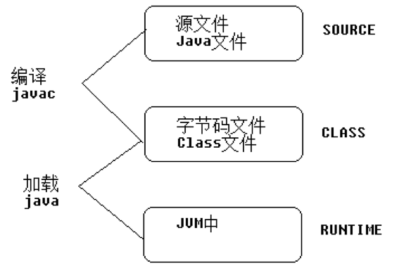
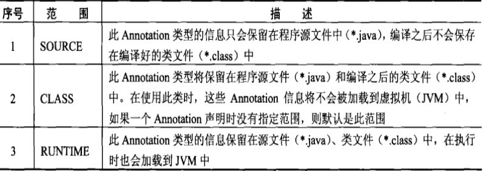

# 注解测试XML
## 1. 什么是注解

所有的Annotation都是java.lang.annotation.Annotation接口的子接口，所以Annotation是一种特殊的接口（枚举是特殊的类）;

```java
@interface Override{} ---> interface Override extends java.lang.annotation.Annotation{}
```
    
所有的枚举类，都是java.lang.Enum类的子类。

```java
    enum Gender{} ---> class Gender extends java.lang.Enum{}
```

>*注解被用来为程序元素（类，方法成员变量等）设置元数据。*

>*注解，标签，Annotation都是一体。*

**使用注解需要三方面的参与**

>1.要有一个注解

>2.被贴的程序元素

>3.需要第三方程序参数，赋予注解特殊的功能

**注解：主要是用来描述程序元素,和xml的功能是一样的，都是用来实现配置信息**

---

##2.JDK中内置的注解
常用注解：

> @Override *限定重写父类的方法*

> @Deprecated *标记已过时的成员，不推荐使用*

> @SuppressWarings *抑制编译器发出的警告**代码的问题任然存在，只是把警告消除了而已***

> @SafeVarargs *抑制堆污染警告（JAVA7开始出现的）堆污染：当方法中有泛型和可变参数的时候，可能出现堆污染警告*


---


##3. JDK中的元注解
**注解：描述数据的数据**

**元注解：描述注解的注解**

> @Retention *表示注解可以保存在哪一个时期，保存的时期值封装在**RetentionPolicy枚举类**中，第三方的程序通常是使用反射（在运行时期生效）来赋予特殊的功能，如果注解都不能保存到运行时期，那么反射是获取不到对应的注解。*

>@Target *表示注解可以贴在哪些位置（类，方法，构造器等等）.位置的常量封装在**ElementType枚举类中***

```java
enum ElementType {
    ElementType.ANNOTATION_TYPE // 只能修饰Annotation
    ElementType.CONSTRUCTOR // 只能修饰构造器方法
    ELementType.FIELD // 只能修饰字段（属性），包括枚举常量
    ElementType.LOCAL_VARIABLE // 只能修饰局部变量
    ElementType.METHOD // 只能修饰方法
    ELementType.PACKAGE // 只能修饰包（极少使用）
    ElementType.PARAMETER // 只能修饰参数
    ElementType.TYPE // 只能修饰类，接口，枚举
}
```

> @Documented *使用@Document标注的标签会保存到API文档中。*

> @Inherited *标注的标签可以被子类继承*

**Java代码中的三种状态**


**Java代码的三种状态详解**


---

##4.自定义注解
```java
@Target({ ElementType.TYPE, ElementType.METHOD }) // 可以使用在类，接口，枚举，以及方法
@Retention(RetentionPolicy.RUNTIME) // 保存到运行时
public @interface MyAnno {
  String value();
  int age() default 18;
  Gender sex() default Gender.OTHER;
}
```
**注意：**

**
1.注解中属性的类型：
**

    基本数据类型，String，Class，注解，枚举，一位数组
  
**2.注解中如果需要给value属性传值，那么可以省略掉value(前提是只有value这么一个属性)
**


---

##5.注解的定义和使用
1.定义注解：
```java
@Target(ElementType.Type) // 表明只能贴在类，接口或者枚举中
@Retention(RetentionPolicy.RUNTIME) // 表明存在的时期，是在Runtime的时候
public @interface 注解名 {
  String value(); // 必须使用抽象方法，在直接中，我们称之为属性，属性使用名词表示
  int age() default 18; // 设置默认值
}
```
**注意:**

  ***数据只能是：基本数据类型，String，Class，Annotation，Enum，数组***

2.使用注解：
```
  @注解名词，但是上面那个只能贴在Target所规定的范围中
```

3.获取注解：
>因为注解可以贴在类，构造器，方法，字段等上面。所以可以在Class,Constructor,Field,Method类中，有操作注解相关的方法：

```java
public boolean isAnnotationPresent(Class annotationClass); // 判断该成员上是否有指定的注解标注。

public Annotation getAnnotation(Class annotationClass); // 获取该成员上的指定的注解

public Annotation[] getAnnotation(); // 获取该成员上所有的注解
```
示例代码
```java
@MyAnno(value = "Frank", age = 18)
public class MyAnnoDemo {
  public static void main(String[] args) {
    // 获取到MyAnnoDemo类的字节码对象
    Class clz = MyAnnoDemo.class;
    // 判断当前类上是否有MyAnno注解
    if (clz.isAnnotationPresent(MyAnno.class)) {
      Annotation annotation = clz.getAnnotation(MyAnno.class);
      // 可以直接强转一下
      MyAnno anno = (MyAnno) annotation;
      System.out.println(anno.value());
      System.out.println(anno.age());
      System.out.println(anno.sex());
    }
  }
}

```
**注意：MyAnno记得加上Retention(RetentionPolicy.RUNTIME)，否则运行之后就没有注释效果了**

##6.单元测试
黑盒测试
>只检查程序功能是否按照<u>*需求规格说明*</u>的规定正常使用，程序是否能适当地接受<u>*输入数据*</u>而昌盛正确的<u>*输出信息*</u>

白盒测试
>按照程序内部的结构测试程序，通过测试来检测产品内部动作是否按照<u>*设计规格说明书*</u>的规定正常进行


---


##7.Junit3.x测试环境搭建

```xml
步骤：
1.导入Junit3.x的jar包
2.创建一个测试类JUnit3Test，继承TestCast类
3.定义一个测试方法（替代了以前的main方法）
  要求：必须是公共的，无法回值，方法名称必须是test为前缀，无参数。
4.在测试方法之前，执行初始化操作（这种代码只需要写一次）
5.在测试方法之后，执行资源销毁操作（这种代码只需要写一次）
6.快速生成测试方法:
  输入test3，代码提示，回车

```


---


##8.Junit4.x测试环境搭建

```xml
1.导入Junit4.x的jar包
2.创建一个测试类JUnit4Test
3.定义一个测试方法（替代了以前的主方法main）
  要求：必须是公共的，无返回值，无参数。
4.在测试方法之前，执行了初始化操作（这种代码只需要写一次）
5.在测试方法之后，执行资源销毁操作（这种代码需要写一次）
```


